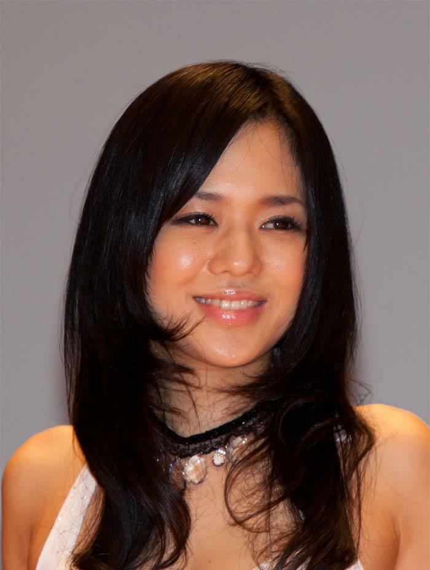
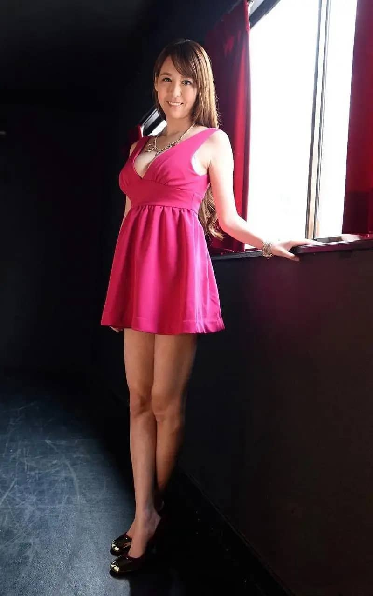
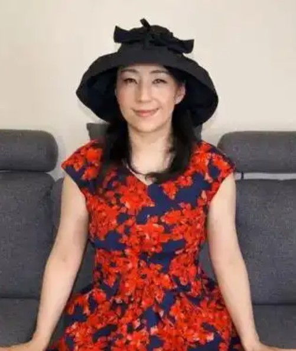

# C 目录

---

| 图片                  | 姓名       | 出生日期   | 出生地       | 出道时间      | 身高   | 体重  | 三围              |
| --------------------- | ---------- | ---------- | ------------ | ------------- | ------ | ----- | ----------------- |
|    | 苍井空     | 1981-4-26  | 日本神奈川县 | 2002-2011     | 155 cm | 45 kg | 86/58/90          |
|    | 朝桐光     | 1982-10-6  | 日本长野县   | 2008          | 164 cm | 47 kg | 88/58/85 cm       |
|  | 长谷真理香 | 1984-10-29 |              |               | 158 cm |       |                   |
|   | 朝宮涼子   |            |              |               | 168 cm |       | B95(E-70)/W60/H89 |
|    | 湊莉久     | 1993-8-1   | 日本神奈川县 | 2013年-2018年 | 160 cm |       |                   |
